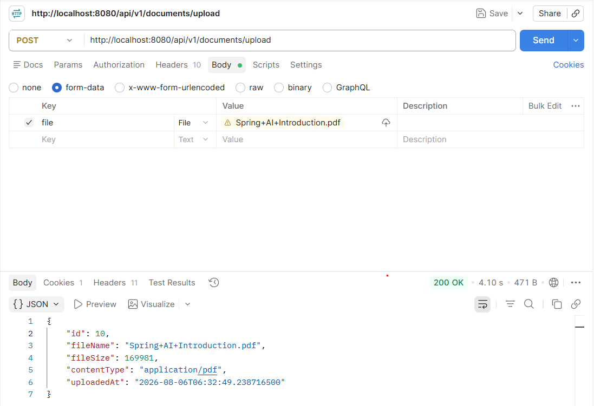
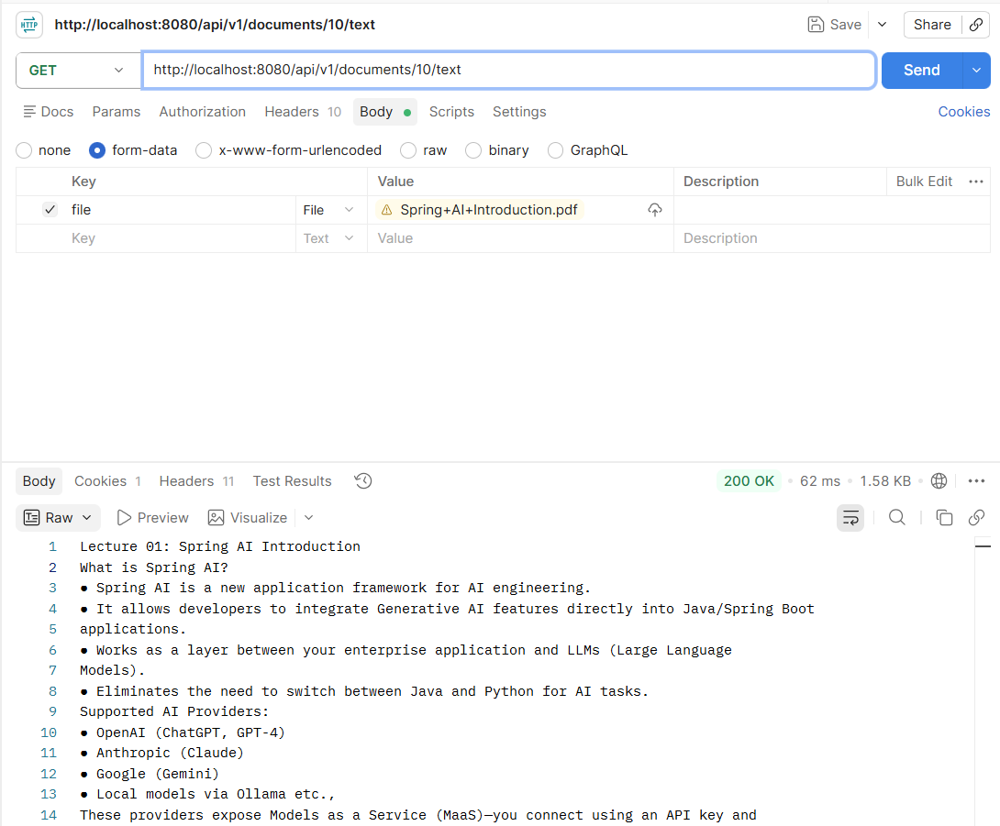
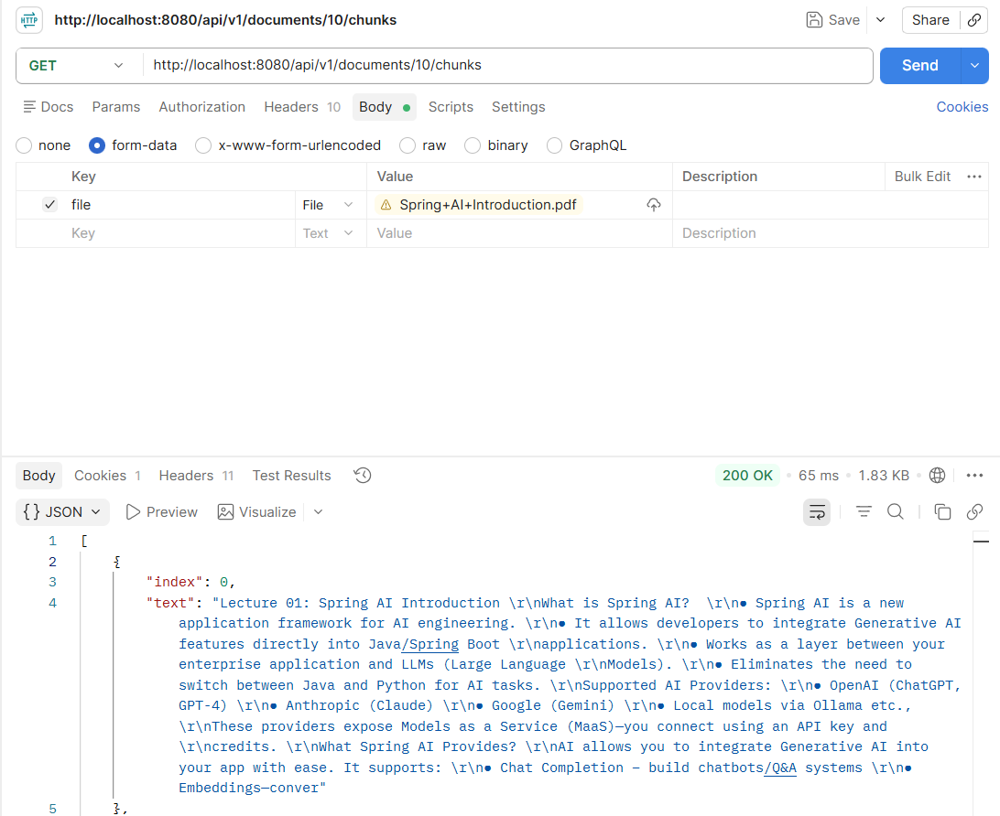
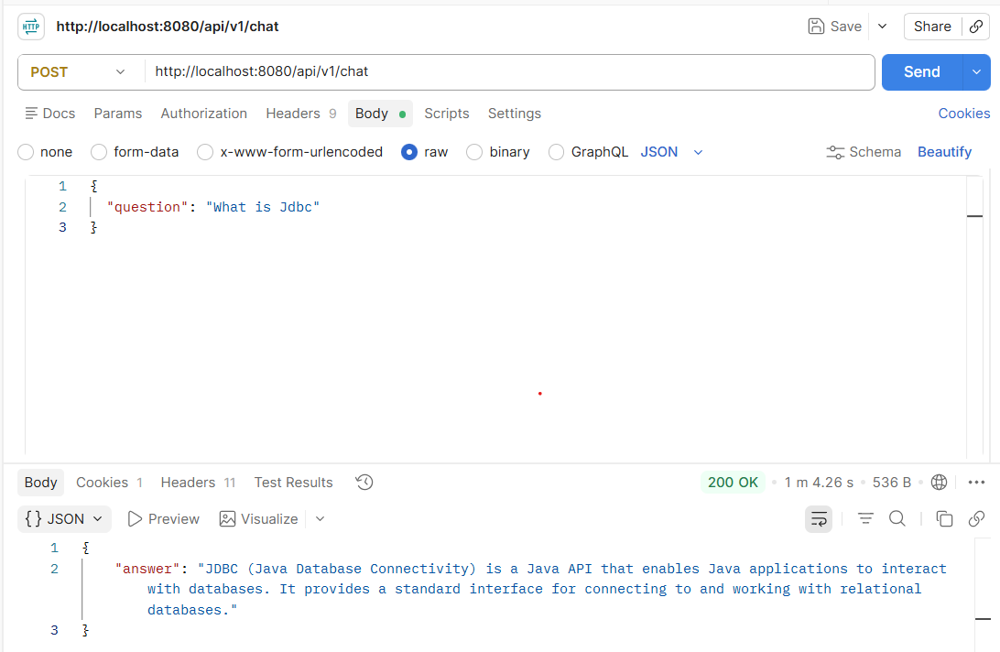

# 🩺 MediAI - AI Powered Medical Document Assistant (RAG)

An AI-powered Retrieval-Augmented Generation (RAG) backend built with **Spring Boot** that allows users to upload PDF documents, automatically indexes them into a vector database, and answers questions based only on the uploaded documents using a local Large Language Model.

---

## 🚀 Features

- User Registration & Login with JWT Authentication
- Secure REST APIs using Spring Security
- Upload PDF documents
- Store files in MinIO Object Storage
- Extract text from uploaded PDFs
- Intelligent text chunking
- Generate vector embeddings using Ollama
- Store embeddings in Qdrant Vector Database
- Semantic document retrieval
- AI-powered Question Answering using RAG
- PostgreSQL for metadata storage

---

# 🏗 Architecture

```
                    +----------------------+
                    |      Frontend        |
                    +----------+-----------+
                               |
                               |
                        REST APIs
                               |
                               v
+------------------------------------------------------------+
|                    Spring Boot Backend                      |
|                                                            |
|  Authentication (JWT)                                      |
|  Document Upload API                                       |
|  Chat API                                                  |
|                                                            |
+-----------+----------------+-------------------------------+
            |                |
            |                |
            v                v
      PostgreSQL         MinIO Storage
            |
            |
            v
     PDF Text Extraction
            |
            |
            v
      Text Chunking
            |
            |
            v
   Ollama Embeddings
(nomic-embed-text)
            |
            |
            v
       Qdrant Vector DB
            |
            |
Semantic Search (Top K)
            |
            |
            v
      Ollama (Qwen 3)
            |
            |
            v
      Final AI Response
```

---

# 🛠 Tech Stack

### Backend

- Java 21
- Spring Boot
- Spring Security
- Spring Data JPA
- Hibernate

### Database

- PostgreSQL

### Object Storage

- MinIO

### Vector Database

- Qdrant

### AI

- Ollama
- Qwen 3
- nomic-embed-text

### Other

- Docker
- Maven
- PDFBox

---

# 📂 Project Structure

```
src
 ├── config
 ├── controller
 ├── dto
 ├── entity
 ├── repository
 ├── security
 ├── service
 ├── rag
 │    ├── chat
 │    ├── embedding
 │    ├── qdrant
 │    └── chunking
 └── HealthcareBackendApplication
```

---

# ⚙ Prerequisites

Install:

- Java 21
- Maven
- Docker Desktop
- Ollama

Pull required models:

```bash
ollama pull qwen3:4b
ollama pull nomic-embed-text
```

---

# 🚀 Running the Project

### Clone Repository

```bash
git clone https://github.com/Sohel-Khowash/MediAI.git
```

```bash
cd MediAI
```

---

### Start Docker Containers

```bash
docker start rag-postgres
docker start rag-minio
docker start rag-qdrant
```

or create them using Docker Compose.

---

### Start Ollama

```bash
ollama serve
```

---

### Run Spring Boot

```bash
mvn spring-boot:run
```

---

# 🔐 Authentication APIs

## Register

```
POST /api/v1/register
```

## Login

```
POST /api/v1/login
```

Returns:

- JWT Token

---

# 📄 Document APIs

## Upload PDF

```
POST /api/v1/documents/upload
```


Body

```
multipart/form-data

file : PDF
```

---

## Extract PDF Text

```
GET /api/v1/documents/{id}/text
```

---

## View Chunks

```
GET /api/v1/documents/{id}/chunks
```

---

# 🤖 Chat API

```
POST /api/v1/chat
```

Example

```json
{
    "question":"What is JDBC?"
}
```

Response

```json
{
    "answer":"JDBC (Java Database Connectivity)..."
}
```

---

# 🧠 RAG Pipeline

```
Upload PDF
      │
      ▼
Store in MinIO
      │
      ▼
Extract PDF Text
      │
      ▼
Chunk Text
      │
      ▼
Generate Embeddings
      │
      ▼
Store Vectors in Qdrant
      │
      ▼
User Question
      │
      ▼
Question Embedding
      │
      ▼
Semantic Search
      │
      ▼
Relevant Context
      │
      ▼
Ollama (Qwen 3)
      │
      ▼
Final Answer
```

---

# 📸 API Screenshots

## User Authentication


---

## Upload PDF



---

## Extract Text




---

## Generated Chunks



---

## Chat Response



---

# Future Improvements

- Conversation History
- Multi-document Retrieval
- Hybrid Search
- Streaming Responses
- Citation of Source Chunks
- Role Based Authentication
- Docker Compose Deployment
- Frontend Integration

---

# Author

**Sohel Khowash**

GitHub

https://github.com/Sohel-Khowash

LinkedIn

(Add LinkedIn URL)

---
